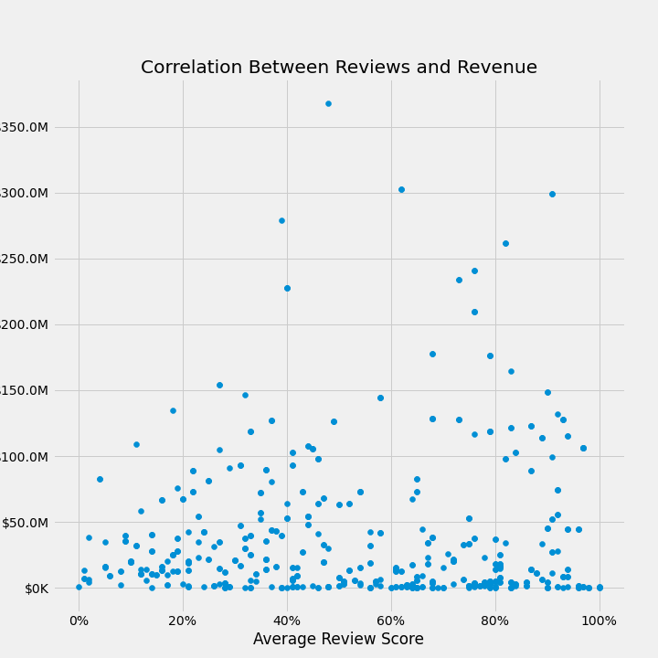
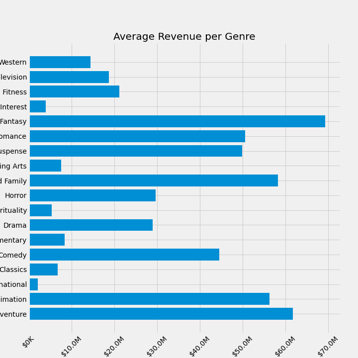
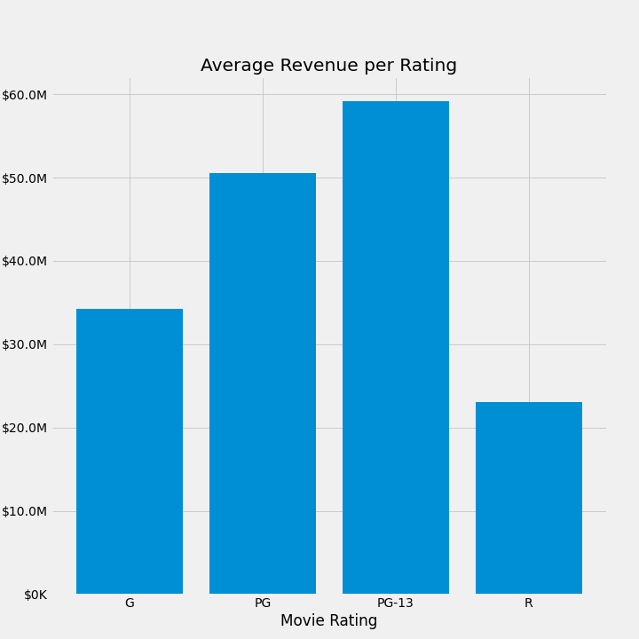

# Where to Start in Movie Production

**Authors**: Jocelyn Fisher

## Overview

Now that Covid-19 has slowed, filming has become easier again and cinemas are opening once more. The movie making industry is in the midst of recovering from one of the biggest slumps it has gone through, and Microsoft wants to use this oppotunity to start their own production studio and ride the wave of resurgence. But with so many well-known studios already out there to compete against, it can be daunting for a new production studio to know where to begin. To tackle this business problem and to see what is considered a successful film in this day and age, this project delves into the various different genres and ratings of movies to find the trends of how they rank in revenue, and whether there is correlation to reviews. Using data sourced from one of the most prevalent rating sites, [Rotten Tomatoes](https://www.rottentomatoes.com), the data analysis finds that the genre Science Fiction & Fantasy, with a movie rating of PG-13, to be the most profitable type of movie. Our recommendations therefore suggest that Microsoft’s new production studio focus on this specific combination for their first production to ensure the best start to the business.


## Business Problem

The core reason the studio was created is because of the enticing profits other large businesses have been making from this type of commercial venture, however this massive competition also poses the main problem faced. In order to make an impact on such a large industry, the studio needs to be able to get above the rest by looking at what a successful type of movie actually is. For the business world, this would be considered the gross box office or revenue a film makes. Understanding what makes a pofitable movie will not only ensure a great start, but also safeguard funds and budgets for films they wish to make further down the track, therefore securing a continuous lucrative enterprise for years to come.


## Data

The data in question that has been collated for this project has been gathered from the ever-popular ratings site, Rotten Tomatoes. In order to understand what to do in the present and future, the analysis needed to explore what has been effective and successful in the past. Our focal variables were:
- `review_score` – represents the average score given to the movie by critics from the website.
- `box_office` – refers to gross USA revenue in U.S. dollars.
- `genre` – the style or category of the movie. Up to three different genres can be attributed to a single film.
- `rating` - the given movie rating, ranging from G, PG-13, MA and R.


## Methods

This project uses descriptive analysis, icluding comparisons between values, therefore providing an insightful overview of movie success and identify genres that go above the rest.


## Results

Unlike what many people may suspect, there was no correlation found between Review Scores and the Revenue, as seen in this scatterplot:


However there were clear winners when it came to which genres and ratings did well in revenue. The genre "Science Fiction and Fantasy" had the highest average revenue at just under $70 million USD, and the movie rating PG-13 won out against the rest, with an average of just under $60 million USD.




## Conclusions

With this analysis, I therefore make the following three recommendations for the beginning of the new Microsoft Movie Production Studio:
- First, focus on producing movies with the Genre of Science & Fiction. With this high performing genre regarding revenue, it will lead into the stability of the business venture by affording it enough budgets to continue making movies in the future.
- Second, the cornerstone of these movies should be based around a PG-13 rating. Combining this profitable rating with the previously mentioned genre will give the studio it's best chance at success when first starting out.
- Lastly, once revenue and funds have been accomplished, the studio can diversify into the highly rated genres of Documentary and Art House & International, to start to make a creative impact within the industry.

***
Questions to consider:
* What would you recommend the business do as a result of this work?
* What are some reasons why your analysis might not fully solve the business problem?
* What else could you do in the future to improve this project?
***

## For More Information

Please review our full analysis in [our Jupyter Notebook] or our [presentation].

For any additional questions, please contact **Jocelyn Fisher** at  **[jocelynclaire216@gmail.com](mailto:jocelynclaire216@gmail.com)**

## Repository Structure

Describe the structure of your repository and its contents, for example:

```
├── __init__.py                         <- .py file that signals to python these folders contain packages
├── README.md                           <- The top-level README for reviewers of this project
├── dsc-phase1-project-template.ipynb   <- Narrative documentation of analysis in Jupyter notebook
├── DS_Project_Presentation.pdf         <- PDF version of project presentation
├── code
│   ├── __init__.py                     <- .py file that signals to python these folders contain packages
│   ├── visualizations.py               <- .py script to create finalized versions of visuals for project
│   ├── data_preparation.py             <- .py script used to pre-process and clean data
│   └── eda_notebook.ipynb              <- Notebook containing data exploration
├── data                                <- Both sourced externally and generated from code
└── images                              <- Both sourced externally and generated from code
```
