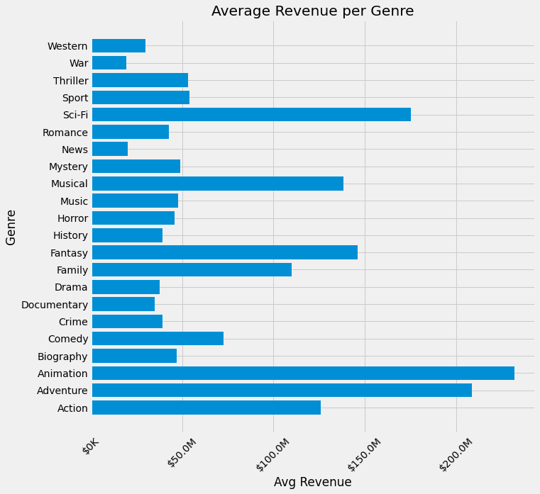

# Where to Start in Movie Production

**Authors**: Jocelyn Fisher

## Overview

Now that Covid-19 has slowed, filming has become easier again and cinemas are opening once more. The movie making industry is in the midst of recovering from one of the biggest slumps it has gone through, and Microsoft wants to use this opportunity to start their own production studio and ride the wave of resurgence. But with so many well-known studios already out there with industry knowledge that Microsoft simply does not yet have, it can be daunting for a new studio to know where to begin. To tackle this business problem and to see what is considered a successful film, this project delves into the various different genres of movies to find the trends of how they rank in revenue and ratings, and what is the best time for a movie to be released to cinemas. Using movie data sourced from one of the most prevalent rating sites, [iMDB](https://www.imdb.com/) collated with financial data from [Box Office Mojo](https://www.boxofficemojo.com/), the data analysis finds that the genres Animation, Adventure and Sci-Fi to be the most profitable type of movie with equally good reviews. The data also showcases the months of the year where the most profits can be seen for movie release dates. Our recommendations therefore suggest that Microsoft’s new produce an Animated film with the genres of Adventure and Sci-Fi, and release to cinemas with the month of *insert months* for their first production to ensure the best start to the business.


## Business Problem

Microsoft has endeavoured to enter the movie making business by creating their own movie production studio. The enticing profits that other large corporations have been making from this type of commercial venture has inspired this project, however this is also the core business problem as they also pose massive competition and have far more background expertise in the industry than Microsoft. In order to make an impact and ensure the best possible start to the studio, it is paramount that Microsoft understands what type of movies are often most successful regarding profits, ratings and the best release month, and use these parameters for their first film. This will ensure funding and budgets for future films they wish to make and the continued success of the project. Microsoft can also use the same analysis with updated market data to view changes in these trends overtime.


## Data

The data I have used to analyse for this project includes movie information from one of the most prevalent and well-known movie rating sites, iMDB, and the financial website Box Office Mojo run by the same company. The reason this data was chosen is because it had the largest spread of movies at over 2800. Once collated and joined, the data files provided the financial data for each movie (including production value and worldwide gross revenue), as well as other key characteristics such as genres and month of release.


## Methods

This project uses descriptive analysis and looks into trends over time. This provides an insightful overview of movie type success in order to identify genres that are financially profitable and well-reviewed, as well as which month of cinema release is best.


## Results

Most movies that do well financially do seem to be within the review score of 6 to 7 out of a total of 10, therefore showcasing that movies that are generally well received also do well in overall profits.


When delving into the genre specific data, there were clear winners when it came to which genres did well in revenue. The genre "Animation" had the highest average revenue at just under $250 million USD. This success could be attributed to the fact that animated films are often associate with family friendly movies, which can be an extremely large customer base but also very diverse. The genres of Adventure and Sci-Fi came in as a close second and third in revenue as well.


There are peaks at specific months of the year that showcase increased movie revenue, likely because they are around the school vacation or holiday periods. This can also be because in order for a movie to qualify for the next round of Oscars and other Academy Awards, it needs to have been on general release before 31st December of the year prior.


## Conclusions

With this analysis, I therefore make the following three recommendations for the beginning of the new Microsoft Movie Production Studio:
- **The studio should focus on producing animated films**. Not only is this category of movie extremely profitable, but it is also very diverse and has a large and stable audience base.
- **Combine the genres of Adventure and Sci-Fi for the first movie**. This profitable combination will lead into the stability of the business venture by ensuring it has enough funds and budget to continue making movies in the future.
- **The cinema release dates of the first movie should be during the months of *insert months here***. These months have been showcased to be a good financial period, but it also means the movies will be qualified to be reviewed for the next Academy Awards.

### Next Steps
Further analysis could produce supplementary understanding of what is considered a successful movie:
- **Investigate what is understood to be an under-performing movie**. This modelling can be done with the current available data and provide insight into which genres do *not* do well regarding revenue and reviews and therefore which ones pose a higher risk to produce.
- **Analyse which movie ratings (such as PG, MA and R) do well regarding reviews and revenue**. Using further external data sources to correlate this information, this could help hone the scope of what is considered a successful movie.
- **Combine the review data with sources from other rating sites and the Academy Awards**. This data will have a more sophisticated, overall understanding of what is considered a film that is worth watching.


## For More Information

Please review our full analysis in our [Jupyter Notebook](Movie_Genre_Analysis.ipynb) or our [Presentation].

For any additional questions, please contact **Jocelyn Fisher** at **[jocelynclaire216@gmail.com](mailto:jocelynclaire216@gmail.com)**

## Repository Structure

Describe the structure of your repository and its contents, for example:

```
├── __init__.py                         <- .py file that signals to python these folders contain packages
├── README.md                           <- The top-level README for reviewers of this project
├── dsc-phase1-project-template.ipynb   <- Narrative documentation of analysis in Jupyter notebook
├── DS_Project_Presentation.pdf         <- PDF version of project presentation
├── code
│   ├── __init__.py                     <- .py file that signals to python these folders contain packages
│   ├── visualizations.py               <- .py script to create finalized versions of visuals for project
│   ├── data_preparation.py             <- .py script used to pre-process and clean data
│   └── eda_notebook.ipynb              <- Notebook containing data exploration
├── data                                <- Both sourced externally and generated from code
└── images                              <- Both sourced externally and generated from code
```
