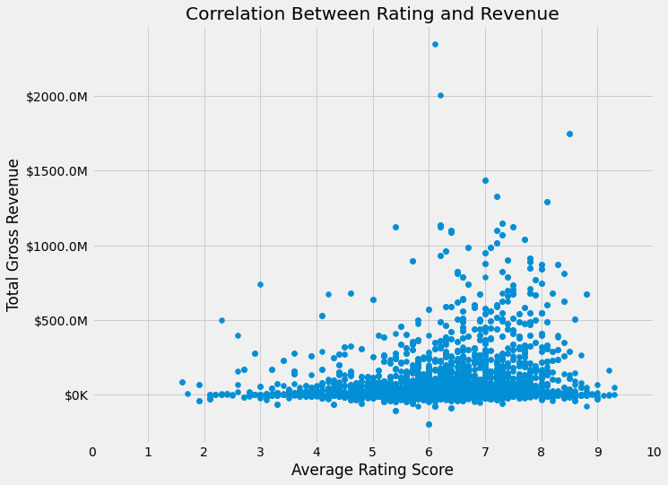
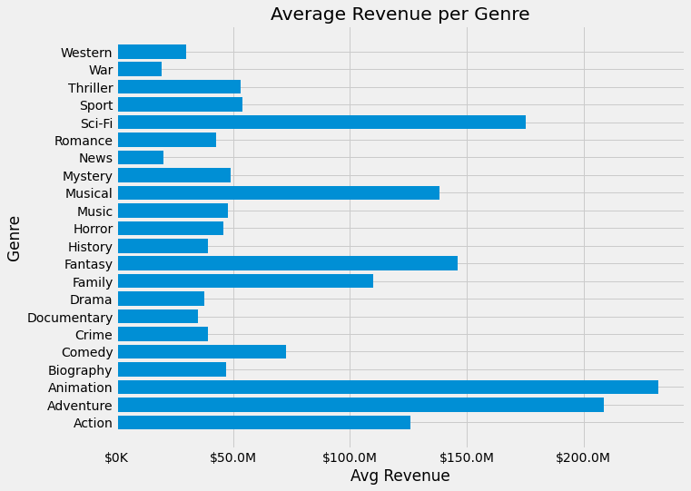

# Where to Start in Movie Production

**Authors**: Jocelyn Fisher

## Overview

Now that Covid-19 has slowed, filming has become easier again and cinemas are opening once more. The movie making industry is in the midst of recovering from one of the biggest financial slumps, and Microsoft wants to use this opportunity to start their own production studio and ride the wave of resurgence. But with so many well-known studios already out there with industry knowledge that Microsoft simply does not yet have, it can be daunting for a new studio to know where to begin. To tackle this business problem and to see what is considered a successful film, this project delves into the various different genres of movies to find the trends of how they rank in revenue and ratings, and what is the best time of the year for a movie to be released to cinemas. Using movie data sourced from one of the most prevalent rating sites, [IMDb](https://www.imdb.com/) collated with financial data from [The Numbers](https://www.boxofficemojo.com/), the data analysis finds that the genres Animation, Adventure and Sci-Fi to be the most profitable type of movie with equally good reviews. The data also showcases that a cinema release in the month of June to be the most successful. Our recommendations therefore suggest that Microsoft’s new studio for their first production create an Animated film with the genres of Adventure and Sci-Fi, release to cinemas with the month of June, and avoid the genres of News, War and Western to ensure the best start to the business.


## Business Problem

Microsoft has endeavoured to enter the movie making business by creating their own movie production studio. The enticing profits that other large corporations have been making from this type of commercial venture has inspired this project, however this is also the core business problem as they also pose massive competition and have far more background expertise in the industry than Microsoft. In order to make an impact and ensure the best possible start to the studio, it is paramount that Microsoft understands what type of movies are often most successful regarding profits, ratings and the best release month, and use these parameters for their first film. This will ensure funding and budgets for future films they wish to make and the continued success of the project. Microsoft can also use the same analysis with updated market data to view changes in these trends overtime.


## Data

The data I have used to analyse for this project includes movie information from one of the most prevalent and well-known movie rating sites, IMDb, and the financial website The Numbers. The reason this data was chosen is because once collated and joined it had the largest spread of movies at over 2,800. The data files provided the financial data and review scores for each movie (including production value and worldwide gross revenue), as well as other key characteristics such as genres and month of release.


## Methods

This project uses descriptive analysis to provide an insightful overview of movie type success in order to identify genres that are financially profitable and well-reviewed, as well as which month of cinema release is best.


## Results

Most movies that do well financially do seem to be within the review score of 6 to 7 out of a total of 10. From this analysis Microsoft can be confident that a successful movie is based around the revenue that it makes, as often those are movies that are well liked by the public.


The genre "Animation" had the highest average revenue at just under $250 million USD. This success could be attributed to the fact that animated films are often associate with family friendly movies, which can be an extremely large customer base but also very diverse. The genres of Adventure and Sci-Fi came in as a close second and third in revenue as well. War, Western and News were the worst performing, for the first two this could possibly be due to the often high production values associated with these types of movies.


There are peaks in the months of March, June, July and November that showcase increased movie revenue. June's profitability is likely because this is during the Winter/Summer school holiday periods. The November peak can be attributed to the fact that in order for a movie to qualify for the next round of Academy Awards, it needs to have been on general release before 31st December of the year prior. Studios will often release movies that they want to qualify for these awards during this month.


## Conclusions

With this analysis, I therefore make the following three recommendations for the beginning of the new Microsoft Movie Production Studio:

- **The studio should focus on producing animated films.** Not only is this category of movie extremely profitable, but it is also very diverse and has a large and stable audience base. Combined with the genres of Adventure and Sci-Fi for the first movie, this profitable combination will lead into the stability of the business venture by ensuring it has enough funds and budget to continue making movies in the future.
- **Avoid the genres of War, Western & News.** These were extremely underperforming when it came to revenue, possibly due to the often high production values of these types of genres, which means less room for error when it comes to box office takings. 
- **The cinema release dates of the first movie should be during the month of June.** This month in particular has been showcased to be the best financial period for cinema release, but it also means the movies will be qualified to be reviewed for the next Academy Awards.

### Next Steps
Further analysis could produce supplementary understanding of what is considered a successful movie:

- **Analyse which movie ratings (such as PG, MA and R) do well regarding reviews and revenue.** Using further external data sources to correlate this information, this could help hone the scope of what is considered a successful movie.
- **Investigate possible trends over the past decade.** This will help showcase further understanding into what genres have been increasing in popularity in recent times, and also what has been doing worse, providing Microsoft with better industry knowledge.
- **Gather correlating data from the Academy Awards.** When coupled with the above analysis processes, this data may have a more sophisticated and professional understanding of what is considered a film that is worth watching.


## For More Information

Please review our full analysis in our [Jupyter Notebook](Movie_Success_Analysis.ipynb) or our [Presentation].

For any additional questions, please contact **Jocelyn Fisher** at **[jocelynclaire216@gmail.com](mailto:jocelynclaire216@gmail.com)**

## Repository Structure

Describe the structure of your repository and its contents, for example:

```
├── README.md
├── Movie_Success_Analysis.ipynb
├── Movie_Success_Presentation.pdf
├── code
│   ├── data
│   └── Data_Cleaning.ipynb
└── images
```
